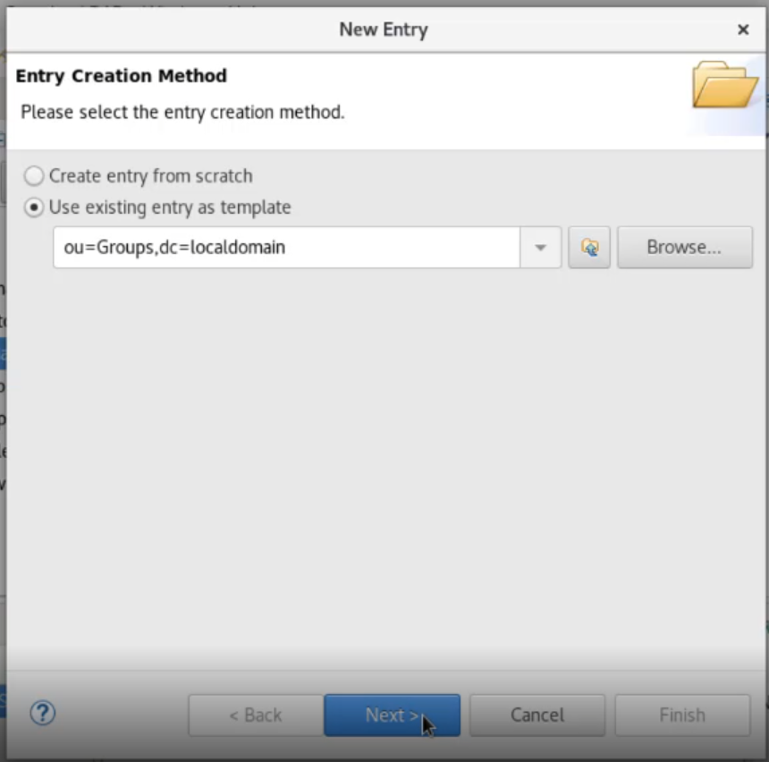
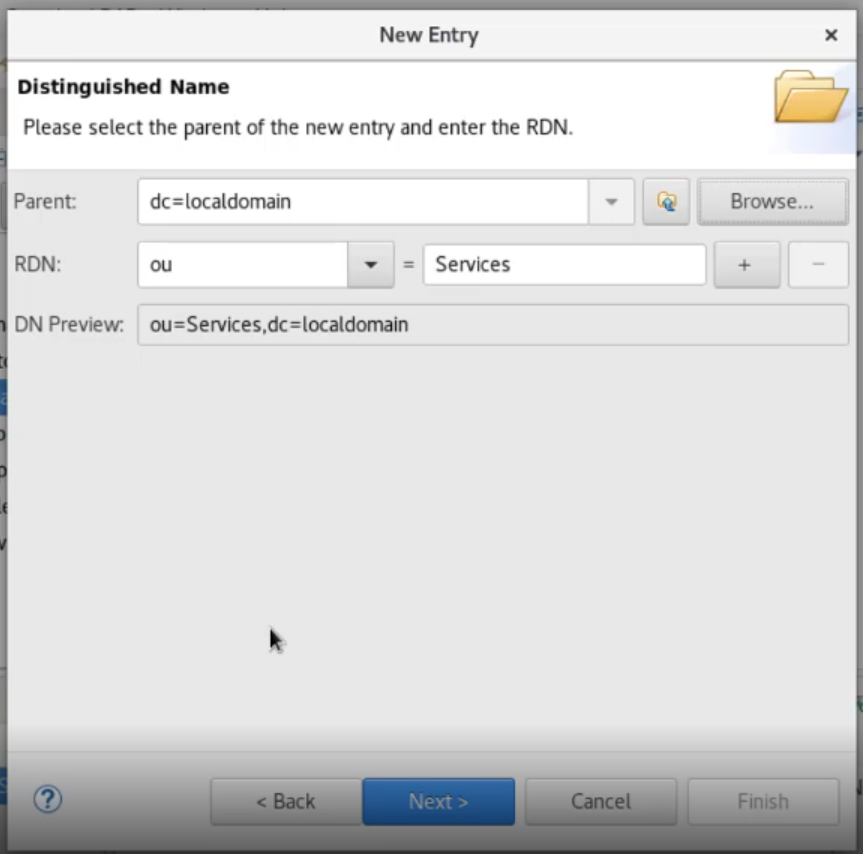
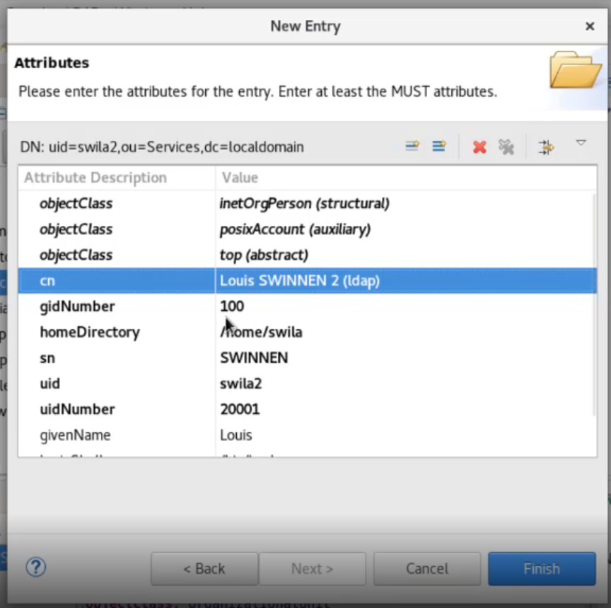

[Retour à la table des matières](../README.md)

# Introduction à Linux

## Les utilisateurs locaux

Visualiser les comptes utilisateurs

`less /etc/passwd`

Avoir des informations sur un compte utilisateur

```
id lionel
```

### Ajouter un utilisateur sur RHEL 8

```
useradd -g users lionel
```

> Un compte qui n’a pas de mot de passe est désactivé par défaut

Donner un mot de passe à un utilisateur

```
passwd lionel
```

### Supprimer un utilisateur sur RHEL 8

```
userdel -r lionel
```

Attention, le dossier personnel dans le /home n’est pas automatiquement supprimé.

> Le paramètre -r permet de supprimer le dossier de l’utilisateur

### Modifier un utilisateur sur RHEL 8

```
chfn lionel
```

### Ajouter un groupe à un utilisateur RHEL 8

```
usermod -G friends lionel
```

## Les groupes locaux

Les groupes locaux se trouvent dans **/etc/group**

La commande `groups lionel` permet de connaître les groupes auxquels un utilisateur appartient.

### Ajouter un groupe

```
groupadd
```

### Modifier un groupe

```
groupmod
```

### Supprimer un groupe

```
groupdel
```

## Les utilisateurs globaux

Script pour lancer l'application de bureau LDAP `dirstud.sh`

### Ajouter une nouvelle entrée

Utiliser une entrée déjà existante pour créer une nouvelle







> Il faut bien modifier le home directory et le uidNumber qui doit être unique et le mot de passe

### Ajouter une nouvelle entrée (Ligne de commande)

Pour ajouter des entrées dans l'annuaire avec en ligne de commande il faut créer des fichier .ldif

Unité organisationnelle ([organizationalUnit.ldif](ldif/organizationalUnit.ldif))

```
dn: ou=Student, ou=People, dc=localdomain
ou: Student
description: Tous les etudiants
objectClass: top
objectClass: organizationalUnit
```

User ([user.ldif](ldif/user.ldif))

```
dn: uid=e190061, ou=Student, ou=People, dc=localdomain
objectClass: top
objectClass: inetorgperson
objectClass: posixAccount
cn: Lionel DUTRIEUX
sn: DUTRIEUX
givenname: Lionel
userPassword: {SSHA} /!\ slappasswd -s rootroot
gidNumber: 100
uidNumber: 15000
homeDirectory: /home/e190061
loginShell: /bin/bash
```

Pour générer un mot de passe

```
slappasswd -s rootroot
```

Group ([group.ldif](ldif/group.ldif))

```
dn: cn=mongroup, ou=Groups, dc=localdomain
description: ma jolie description
objectClass: top
objectClass: posixGroup
gidNumber: 15100
```

Add Member ([addMember.ldif](ldif/addMember.ldif))

```
dn: cn=mongroup, ou=Groups, dc=localdomain
changetype: modify
add: memberuid
memberuid: e190061
```

Permets d'ajouter à un groupe l'uid d'un utilisateur

Commande pour appliquer le fichier .ldap

```
ldapadd -D 'cn=Directory Manager,dc=localdomain' -f /tmp/ou.ldif -x -W
```