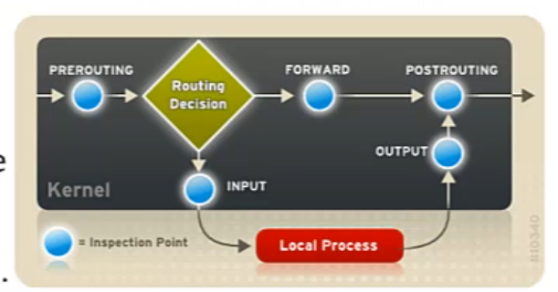

[Retour à la table des matières](../README.md)

# Le firewall

Nous allons configurer un firewall avec NFT tables



| Point d'inspection | Description |
| - | - |
| prerouting, postrouting | Ces points d'inspections sont utilisés pour le **NAT** notamment. Soit pour translater les paquets en sortie, soit pour rediriger les paquets entrants |
| input | Permet d'ajouter des règles pour le trafic entrant |
| forward | Permet d'ajouter des règles pour le trafic en transit |
| output | Permet d'ajouter des règles pour le trafic sortant |

| Vocabulaire | Explication |
| - | - |
| Règles | Les règles permettent de filtrer le trafic en fonction des caractéristiques mentionne (interfaces, IP, ...), Les règles sont placées dans des chaînes |
| Chaines | Les chaînes permettent de grouper les règles. Une chaine peut être attachée à un point d'inspection (input, forward, etc) et comporter une politique par défaut. Elles peuvent aussi ne pas être liées à un point d'inspection, elles permettent alors de structurer le firewall |
| Tables | Les tables sont un groupement de chaînes. Dans les firewalls simples, une seule table peut être définie. dans les pare-feu pour routeur (impliquant du NAT), 2 tables distinctes seront requises |

## Les tables

Pour gérer les tables, nous utiliserons l'outil nft:

### Création

```
nft add table inet SwillaWall
```

### Lister

```
nft list tables
```

### Supprimer les tables

```
nft delete table inet SwilaWall
```

## Les chaînes

### Ajouter une chaine

```
nft add chain inet SwilaWall entree {type filter hook input priority 0 \; }
```

Cette commande crée une chaîne basique, attachée au point d'inspection input. Elle est créée dans la table SwilaWall et se nomme entree.

- **Hook** peut préciser input, output, forward, prerouting, postrouting
- **Type** peut être filtrer (pour des chaînes comportant des règles de fitlrage), route (pour marquer les paquets), ou nat (si des règles de NAT sont contenues)
- Priority mentionne a quel moment la chaîne est prise en compte.

### Lister les chaînes

```
nft list chains
```

### Supprimer une chaine

```
nft delete chain inet SwilaWall entree
```

## Les règles

La règle comporte une caractéristique et une action

La caractéristique permet d'identifier le trafic concerné. Par exemple:

- L'interface d'entrée (meta iif) ou l'interface de sortie (meta oif)
- L'état de la connexion TCP (ct state) qui peut être established, related, new, invalid
- Le message icmp déterminé (icmp type ou ocmp6 type)
- Le port TCP ou UDP (udp dport, udp sport, tcp dport, tcp sport)
- L'adresse IP concernée (ip saddr, ip daddr, ip protocol, ip6 saddr, ip6 daddr, ip6 nexthdr)

L'action détermine la décision (filtrage) ou la modification (NAT):

- accept: le trafic est accepté
- drop: le trafic est jeté
- reject: le trafic est rejeté avec réponse à l'expéditeur
- log: le trafic est enregistré dans les journaux
- masquerade: (NAT) la translation d'adresse est opérée
- jump: le trafic est transmis à une autre chaîne

[nfttables.org](https://wiki.nftables.org/wiki-nftables/index.php/Quick_reference-nftables_in_10_minutes)

## Appliquer les règles 

```
nft -f ./server.nft
```

## Sauvegarder un firewall

```
nft list ruleset > /etc/nftables/default.nft
```

> Ne pas oublier de le sauvegarder !

## Firewall et routeur

Afin de structurer les règles du firewall, nous allons créer les chaînes utilisateurs suivantes:

- D'internet vers le routeur (untrust_to_firewall)
- D'internet vers le réseau interne (untrust_to_trust)
- Du réseau interne vers le routeur (trust_to_firewall)
- Du réseau interne vers internet (trust_to_untrust)
- Du routeur vers internet (firewall_to_untrust)
- Du routeur vers le réseau interne (firewall_to_trust)

## Exemples

```
vim server.nft
```

Exemple simple sans NAT

```powershell
#!/usr/sbin/nft -f

### DECLARATION
define LAN4_INTERNAL = { 172.18.1.0/24 }
define LAN6_INTERNAL = { fe80::/10 }
define PUBLIC_TCP_PORT = { 22, 53, 80, 443 }
define PUBLIC_UDP_PORT = { 53 }

# Flush all rules
flush ruleset

table inet SwilaWall {
    chain incoming {
        type filter hook input priority 0; policy drop;
        meta iif lo accept comment "Accept localhost traffic"
        ct state new tcp dport $PUBLIC_TCP_PORT accept comment "Accept TCP Open ports"
        udp dport $PUBLIC_UDP_PORT accept comment "Accept UDP Open ports"
        ct state established,related accept
        ct state invalid drop
        ip saddr $LAN4_INTERNAL ip protocol icmp accept
        ip6 saddr $LAN6_INTERNAL ip6 nexthdr icmpv6 accept
        log
    }

    chain forwarding {
        type filter hook forward priority 0; policy drop;
    }

    chain outgoing {
        type filter hook output priority 0; policy drop;
        meta oif lo accept comment "Accept localhost traffic"
    }

}
```

Exemple avec du NAT (Routeur)

```powershell
#!/usr/sbin/nft -f

### DECLARATION
define UNTRUST_IP = 192.168.190.50
define UNTRUST_IF = ens160
define TRUST_NET = 172.18.1.0/24
define TRUST_IF = ens224
define SERVER1_IP = 172.18.1.3
define SERVER1_TCP = { 21, 22, 53, 80, 443, 30000-33000}
define SERVER1_UDP = { 53 }

flush ruleset

table inet SwilaWall {


    chain firewall_to_untrust {
        accept
    }

    chain untrust_to_firewall {
        ct state invalid drop
        ct state established,related accept
        log
        drop
    }

    chain trust_to_firewall {
        accept
    }

    chain firewall_to_trust {
        accept
    }

    chain trust_to_untrust {
        accept
    }

    chain untrust_to_trust {
        ct state new ip daddr $SERVER1_IP tcp dport $SERVER1_TCP accept
        ip daddr $SERVER1_IP udp dport $SERVER1_UDP accept
        ct state invalid drop
        ct state established,related accept
        log
        drop
    }

    chain incoming {
        type filter hook input priority 0; policy drop;
        meta iif lo accept
        meta iif $UNTRUST_IF jump untrust_to_firewall
        meta iif $TRUST_IF jump trust_to_firewall
        log
    }

    chain forwarding {
        type filter hook forward priority 0; policy drop;
        meta iif $UNTRUST_IF meta oif $TRUST_IF jump untrust_to_trust
        meta iif $TRUST_IF meta oif $UNTRUST_IF jump trust_to_untrust
        log
    }

    chain outgoing {
        type filter hook output priority 0; policy drop;
        meta oif lo accept
        meta oif $UNTRUST_IF jump firewall_to_untrust
        meta oif $TRUST_IF jump firewall_to_trust
        log
    }
}

table inet SwilaWallNAT {

    chain nat_in {
        type nat hook prerouting priority -100;
        meta iif $UNTRUST_IF ip daddr $UNTRUST_IP tcp dport $SERVER1_TCP dnat to $SERVER1_IP
        meta iif $UNTRUST_IF ip daddr $UNTRUST_IP udp dport $SERVER1_UDP dnat to $SERVER1_IP
    }

    chain nat_out {
        type nat hook postrouting priority 100;
        meta oif $UNTRUST_IF ip saddr $TRUST_NET masquerade
    }
}
```

Autoriser le protocol ICMP

```
ip protocol icmp accept

icmp type echo-request ip saddr 192.190.190.0/24 accept
```