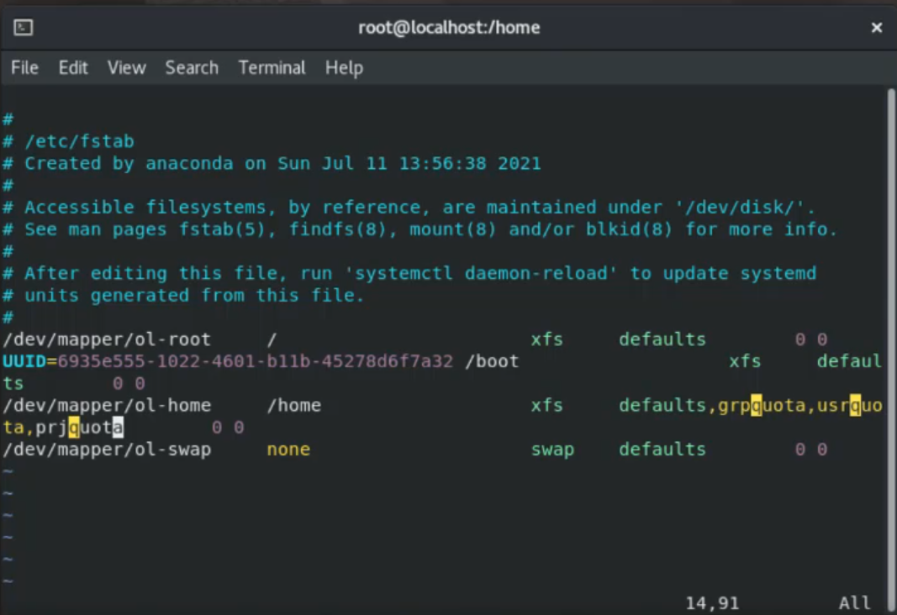

[Retour à la table des matières](../README.md)

# Administration du disque dur

## Les entrées dans le système de fichiers

| Type | Caractère | Exemple
| --- | --- | --- |
| Dossiers | d | **d**rwxr-xr-x |
| Fichiers | - | -rw-r--r-- |
| Liens symboliques | l | **l**rwxrwxrwx |
| Périphériques blocs | b | **b**rw-rw---- |
| Périphériques caractères | c | **c**rw-rw-rw- |
| Sockets locals | s | **s**rwxr-xr-x |
| Tubes nommés | p | **p**rw------- |

### Créer un lien symbolique vers un fichier

```
ln -s /etc/hosts /root/monhosts 
```

## Les droits UNIX

Il y a 3 permissions, une pour le propriétaire, le groupe et le reste (rwx rwx rwx)

### Dossier

- **r** read directory
- **w** write and modify
- **x** allow to open this folder

### Fichiers

- **r** read file
- **w** write and modify this file
- **x** allow to execute this file

### Modifier les droits UNIX

```
chmod 750 mondossier
chmod u=rwx, g=rx, o=- mondossier
```

### Changer le propriétaire

```
chown lsw:users mondossier
```

## Les droits ACL

Il y a 2 outils pour set et get les acl

```
setfacl
getfacl
```

### Appliquer les ACL sur un utilisateur

u: user
g: group

```
setfacl -m u:e190061:rwx myfolder
```

### Propager les droits ACL (plusieurs dossier imbriqué)

d: default

```
setfacl -m d:u:e190061:rwx myfolder
```

### Enlever les droits ACL

g: group

```
setfacl -m g:users:- myfolder
```

## Les quotas XFS

### Activer les quotas

Modification du quotas sur la partition home

```
sudo nano /etc/fstab

après defaults: grpquota, usrquota, prjquota
```



Appliquer les modifications

```
systemctl daemon-reload

umount /home
mount /home
```

### Fixer un quota

Cette commande permet de fixer un quota sur un utilisateur ou un groupe

```
xfs_quota -x -c 'limit bsoft=100m bhard=110m e190061' /home
```

### Fixer un quota pour un projet

```
echo 100:/home/partage >> /etc/projects
echo partage:100 >> /etc/projid
xfs_quota -x -c 'project -s partage' /home
xfs_quota -x -c 'limit -p bhard=200m partage' /home
```

### Connaître les quotas

```
xfs_quota -x -c ‘report -a -h’ /home
```

### Créer un fichier volumineux

```
su - users
dd if=/dev/zero of=./bigfile bs=1M count=200
```