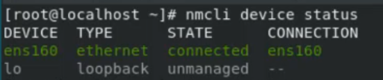

[Retour à la table des matières](../README.md)

# Configuration réseau et démarrage / arrêt du système

## Afficher la configuration réseau

```
ip addr show
ip link show
ifconfig
ip route show
```

## Modifier la configuration réseau (Commande)

Network Manager

```
nmcli device status
```



### Visualiser le profile

```
nmcli -p connection show ens160
```

### Modifier le profile

```
nmcli connection modify ens160 ipv4.method manual
ipv4.address 10.0.1.2/24 ipv4.gateway 10.0.1.1 ipv4.dns 9.9.9.9
ipv4.dns-search localdomain
```

Pour activer les modifications

```
nmcli device disconnect ens160
nmcli device connect ens160
```

### Ajouter une adresse ip

```
nmcli connection modify ens160 +ipv4.address30 10.0.1.3/24
```

### Reset les modifications du profile

```
nmcli connection modify ens160 ipv4.method auto
```

## Modifier la configuration réseau (Interface graphique)

```
nmtui
```

## Outils réseau

```powershell
ping
traceroute www.google.com ou -I
netstat -l -n #Afficher les ports
tcpdump -i ens33 port 25 #Capture le traffic
wireshark
arp -a # Affiche le contenu de la table arp
nslookup www.google.com # Contact le dns
host www.google.com ou host www.google.com 8.8.8.8
dig +trace www.swi.la # Afficher les differents serveurs
```

## Démarrage du système

Cette commande liste la liste des services activés sur le système

```
systemctl list-unit-files --type service
```

### Démarrer un service

```
systemctl start sshd
```

### Activer / Desactiver un service du démarrage

```
systemctl enable sshd ou systemctl enable --now sshd # Start
systemctl disable sshd
```

### Lancer une commande au démarrage

```
nano /etc/rc.d/rc.local
command
```

> Une fois la commande ajoutée, il faut rendre le fichier /etc/rc.d/rc.local chmod +x /etc/rc.d/rc.local

## Arrêt du système

```
systemctl poweroff
poweroff
halt -p
shutdown -h +5
```

### Reboot

```
systemctl reboot
reboot
shutdown -r +5
```