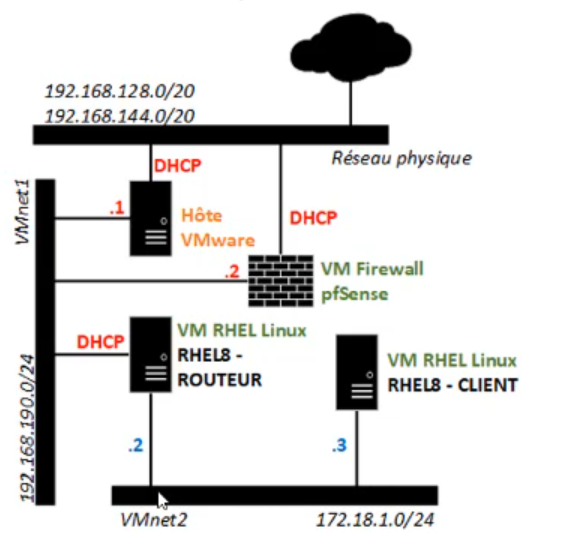

[Retour à la table des matières](../README.md)

# Configuration du routage

Un routeur est une machine disposant de plusieurs interfaces réseau.

Un routeur est configuré pour que le trafic réseau passe d'une interface à l'autre.

> /!\ Il faut ajouter une seconde interface réseau pour la machine routeur (VMnet 2). Toutes les autres machines doivent être connectées sur l'interface Vmnet2



## Configuration du routage

Ajouter un profile avec `nmtui` qui porte le même nom que l'interface

Configurer l'adresse IP, DNS, Gateway du routeur

> Ne pas oublier de modifier la configuration réseau des machines clientes (Gateway)

### Rendre la machine en routeur

```
nano /etc/sysctl.d/10-ipforward.conf

# Enabling IP Forwarding
net.ipv4.ip_forward = 1
```

Activer la modification

```
echo 1 > /proc/sys/net/ipv4/ip_forward
```

> /!\ Pfsense **bloque** le trafic de la nouvelle machine !

Il va falloir mettre en place du NAT sur le routeur

```powershell
nft add table ip nat
nft add chain nat postrouting { type nat hook postrouting priority 100 \; }
nft add rule nat postrouting ip saddr 192.168.131.0/24 masquerade # IP A CHANGER
nft list ruleset > /etc/nftables/default.nft # Rendre la config persistente
```

## Outils réseau

```powershell
nmap -A -T4 127.0.0.1 # Detecter les ports ouverts
nmap -sP 192.168.1.0/24 # Trouver les machines qui répondent au ping
telnet ip port # Permet d'avoir les versions des logiciels
hping3 -S 192.168.190.2 -p 1080 # Permet de contourner le ping
sending file with hping https://www.codebelay.com/blog/2008/10/09/sending-files-with-hping3/
```

```
hping3 172.18.1.2 --icmp –d 100 --sign monfichier --file /etc/passwd hping3 --listen 172.18.1.2 –I ens224 --sign monfichier --icmp
```

```
hping3 -z -t 1 -S www.swila.be -p 80 # Traceroute via hping3
```