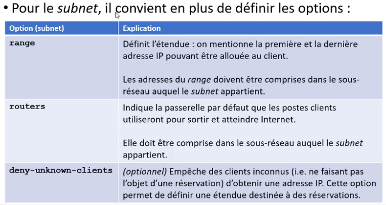

[Retour à la table des matières](../README.md)

# Les services réseau de base

## SSH

Configuration:

- Client: `/etc/ssh/ssh_config`
- Serveur: `/etc/ssh/sshd_config`

> La connexion en tant que root devrait être désactivé pour des raisons de sécurité

### Démarrer le service SSH

```
systemctl restart sshd
systemctl disable --now sshd
```

### Authentification par clé

#### Générer la paire de clés

```
ssh-keygen -t rsa -b 4096 # LESS SECURE
ssh-keygen -t ed25519 # SECURE
```

Il faut entrer un code de verrouillage de la clé (une longue phrase qui permet de déverrouiller la clé)

#### Ajout de la clé pour le compte visé

```
ssh-copy-id -i ./ssh/id_rsa.pub lswinnen@192.168.1.1
```

> Attention les commandes rsync ou scp peuvent s'exécuter sans mot de passe ou code de déverrouillage (Jamais vers le compte root)

### Agent SSH

Programme qui retient en mémoire les clés déverrouillées.

```
eval $(ssh-agent)

ssh-ad ~/.ssh/id_rsa
ssh-ad ~/.ssh/id_ed25519
```

### X11

```
ssh -X e190061@datgagnan
xeyes
```

### Les tunnels SSH

```
ssh -L 8000:127.0.0.1:80 e190061@dartagnan.cg.helmo.be
```

## DHCP

Distribution de la configuration réseau aux clients

> DHCP utilise le port **67** et **68**

|Option| Explication |
| - | - |
| option domain-name | Mentionne le nom de domaine DNS qui sera configuré au niveau des postes clients|
|option domain-name-servers | Permet d’indiquer des serveurs DNS à transmettre aux clients. Les clients interrogeront ces serveurs DNS.|
|default-lease-time | Mentionne en seconde la durée du bail par défaut c’est-àdire le temps pour lequel l’adresse IP est donnée|
|max-lease-time | Mentionne, en seconde, la durée maximale du bail. C’est le temps maximum pour lequel l’adresse IP est donnée.|
|ntp-servers | Mentionne les serveurs de temps à transmettre aux postes client.|
|ddns-update-style | Active ou désactive les mises à jour DNS|
|authoritative | Mentionne si le serveur DHCP fait autorité sur le réseau|
|log-facility | Détermine comment les traces systèmes sont conservées|



### Configurer DHCP

Copier le fichier d'exemple

```
cd /etc/dhcp
cp /usr/share/doc/dhcp-server/dhcpd.conf.example ./dhcpd.conf
```

Éditer le fichier `dhcpd.conf`

```
vim dhcpd.conf
```

Il faut supprimer tous les subnets sauf 1 seul que l'on va modifier

Configurer le domain-name et les serveurs DNS:

```
domain-name: "localdomain";
domain-name-server 9.9.9.9, 1.1.1.1;
```

Créer un `shared-network` (Vidéo: 48:00)

```
shared-network RESEAU-CLIENT {
    subnet 172.18.1.0 netmask 255.255.255.0 {
        range 172.18.1.20 172.18.1.50;
        option routers 172.18.1.2;
        option broadcast-address 172.18.1.255;
    }
}
```

```
systemctl start dhcpd
```

Une fois le service DHCP configuré, il faut modifier les clients avec `nmtui` en automatique.

#### Fixer une adresse ip à une machine

```
host name {
    hardware ethernet MAC_ADDRESS;
    fixed-address 172.18.1.90;
}
```

> Attention les adresses IP fixe ne peuvent pas se trouver dans la range du serveur DHCP

## NTP

Permets de synchroniser et distribuer le temps aux machines.

### Configurer NTP

```
vim /etc/chrony.conf
```

#### Autoriser les IP

```
allow 172.18.1.0/24
```

#### Refuser les IP

```
deny 172.18.1.25
```

#### Démarrer NTP

```
# Synchroniser son horloge
chronyd -q 'server ntp1.oma.be iburst'

systemctl enable --now chronyd
systemctl status chronyd

chronyc sources
```