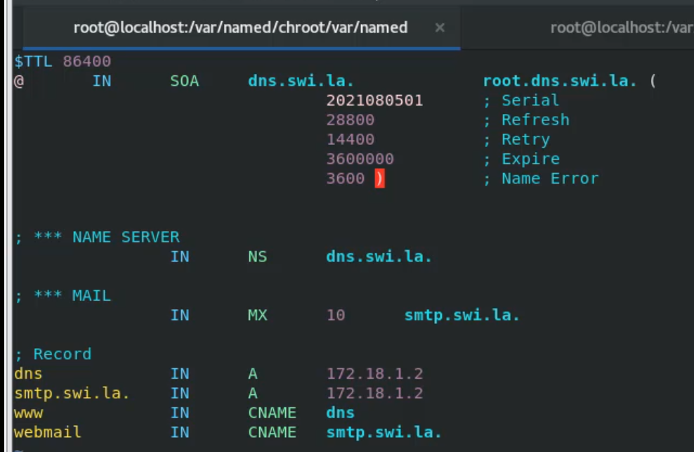
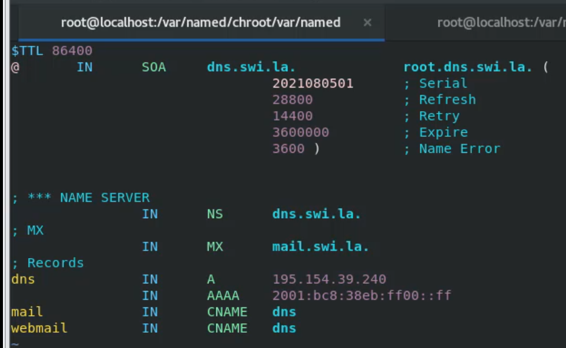
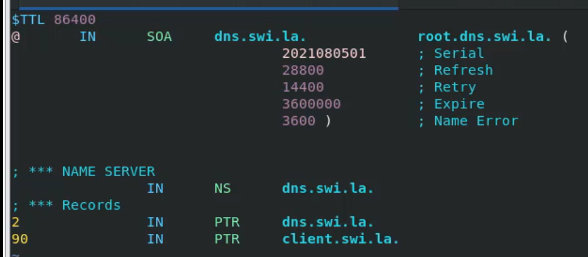

[Retour à la table des matières](../README.md)

# Le service DNS

Il y a 2 type de serveur DNS, interne et externe.

| Type d’entrée |  |
| --- | --- |
| A | Name ⇒ IPV4 |
| AAAA | Name ⇒ IPV6 |
| CNAME | Name ⇒ Name |
| MX | Mail |
| NS | DNS |
| TXT | Texte (challenge) |

Vérifier le serveur DNS d'un nom de domaine

```
host -t NS swilabus.be
```

## Installer un serveur DNS

```
dnf install bind-chroot
```

## Configurer le DNS

Ce déplacer dans le dossier chroot:

```
cd /var/named/chroot/etc/
```

Copier le fichier d'exemple:

```
cp /usr/share/doc/bind/sample/etc/* ./
```

Modifier le fichier `named.conf`

```
nano named.conf
```

Configuration:

```
listeb-on port 53 {any};    # Ecoute sur toutes les IPV4
listeb-on-v6 port 53 {any}; # Ecoute sur toutes les IPV6

allow-query { any }
allow-query-cache { any }

recursion yes;

version "1234";             # Modifier la version retourné par le serveur
forwarders {1.1.1.1; }      # Utilise le serveur DNS 1.1.1.1
```

Le fichier de configuration de base utilise 3 views

- localhost_resolver
- internal
- external

Les views localhost_resolver et internal vont être fusionnées, donc supprimer `localhost_resolver` et modifier `internal`:

```
match-clients       {localnets; localhost; }
```

### Création d'une zone DNS

#### NAME => IP

Pour la view internal:

```
zone "swi.la" {
    type master;
    file "db.swi.la.internal";
    allow-update { none; };
    allow-transfer { none; };
}
```

Pour la view external:

```
zone "swi.la" {
    type master;
    file "db.swi.la.external";
}
```

Les entrées `my.internal.zone`, `my.slave.internal.zone`, `my.ddns.internal.zone` peuvent être supprimées.

#### IP => NAME

Ajouter une nouvelle zone

```
zone "1.18.172.in-addr.arpa" {
    type master;
    file "db.172.18.1";
    allow-update { none; };
    allow-transfer { none; };
}
```

### Configuration des fichiers de zone

Se déplacer dans le dossier named:

```
cd /var/named/chroot/var/named/
```

Copier les exemples:

```
cp -a /usr/share/doc/bind/sample/var/named/* ./
```

Créer le dossier `dynamic`:

```
mkdir dynamic
```

Changer le propriétaire des fichiers:

```
chown -R named.named *
```

Nettoyer les fichiers non utiles:

```
rm my.*
rm slaves/my.*
```

Créer votre fichier de configuration `db.swi.la.internal`:

```
nano db.swil.la.internal
```

```
$TTL 86400
@ TAB IN TAB SOA TAB dns.swi.la. TAB root.dns.swi.la. (2021080501 TAB; Serial 28800 TAB; Refresh 14400; Retry 36000000 ; Expire 3600) ; Name Error
```

> Attention à faire des tabulations et pas des espaces

> 2021080501 ⇒ Date à l’envers + 01



Pour la zone externe `db.swi.la.external`:



La configuration est la même, nous utilisons des adresses ip externe à la place.

Pour la zone inverse `db.172.18.1`:



#### Redémarrer le service DNS

```
systemctl start named-chroot
systemctl enable named-chroot
```

> nmtui et modifier le serveur dns par lui-même 127.0.0.1

## Exemples

named.conf

```
options
{
	// Put files that named is allowed to write in the data/ directory:
	directory 		"/var/named";		// "Working" directory
	dump-file 		"data/cache_dump.db";
	statistics-file 	"data/named_stats.txt";
	memstatistics-file 	"data/named_mem_stats.txt";
	secroots-file		"data/named.secroots";
	recursing-file		"data/named.recursing";


	listen-on port 53	{ any; };
	listen-on-v6 port 53	{ any; };

	allow-query { any; };
	allow-query-cache { any; };

	recursion yes;

	version "1234";
	forwarders	{1.1.1.1; };

	dnssec-enable yes;

	dnssec-validation yes;

	pid-file "/run/named/named.pid";
	session-keyfile "/run/named/session.key";

	managed-keys-directory "/var/named/dynamic";

    include "/etc/crypto-policies/back-ends/bind.config";
};

logging 
{
	channel default_debug {
		file "data/named.run";
		severity dynamic;
	};
};


view "internal"
{

	match-clients	{ localnets; localhost; };
	recursion yes;

	zone "." IN {
		type hint;
		file "/var/named/named.ca";
	};

	include "/etc/named.rfc1912.zones";

	zone "dutrieux.swilabus.com" {
		type master;
		file "db.dutrieux.swilabus.com.internal";
		allow-update { none; };
		allow-transfer { none; };
	};
};

view "external"
{

	match-clients		{ any; };

	zone "." IN {
	        type hint;
	        file "/var/named/named.ca";
	};

	recursion no;

	zone "dutrieux.swilabus.com" { 
		type master;
		file "db.dutrieux.swilabus.com.external";
	};
};
```

db.dutrieux.swilabus.com.internal

```
$TTL 86400
@   IN  SOA dns.dutrieux.swilabus.com.  root.dns.dutrieux.swilabus.com. (2023012101 28800   14400   3600000 3600)

; *** NAME SERVER
    IN  NS  ns.dutrieux.swilabus.com.

; *** MAIL
    IN  MX  10  smtp.dutrieux.swilabus.com.

; *** RECORD
ns IN  A   192.168.190.115 ; IP de votre serveur
gate    IN  A   192.168.190.2
pfsense IN  CNAME   gate.dutrieux.swilabus.com.
```

db.dutrieux.swilabus.com.external

```
$TTL 86400
@   IN  SOA dns.dutrieux.swilabus.com.  root.dns.dutrieux.swilabus.com. (2023012101 28800   14400   3600000 3600)

; *** NAME SERVER
    IN  NS  gate.dutrieux.swilabus.com.

; *** MAIL
    IN  MX  10  smtp.dutrieux.swilabus.com.

; *** RECORD
gate IN  A   192.168.254.132 ; IP de votre serveur public
ns  IN  CNAME   gate.dutrieux.swilabus.com.
pfsense IN  CNAME   gate.dutrieux.swilabus.com.
```