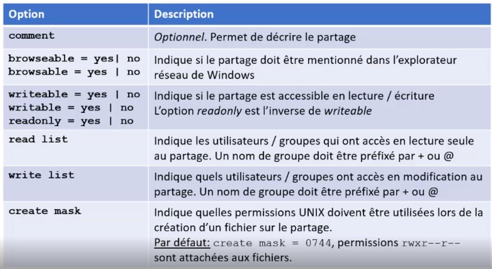
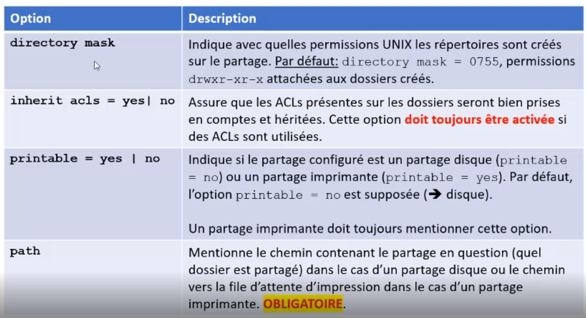

[Retour à la table des matières](../README.md)

# Le service SAMBA

Permets à des machines Linux de partager des ressources avec des machines Windows.

Fichier de configuration:

```
vim /etc/samba/smb.conf
```

| Section | Utilisation |
| - | - |
| [globale]| Contient la configuration globale du serveur |
| [homes]| Décrit le partage des dossiers personnels des utilisateurs (Actif par défaut) |
| [globale]| Décrits le partage des imprimantes configurées sur le serveur (Actif par défaut) |

## La section [globale]

| Option | Utilisation | Option | Utilisation
| - | - | - | - |
| workgroup | Indique le groupe de travail | server string | Description du serveur |
| netbios name | Nom de la machine sous SAMBA. Par défaut, le nom d'hôte. **Unique** | interfaces hosts allow | interfaces = mentionne la liste des interfaces réseaux sur lesquelles SAMBA répond. |
| load printers | Mentionne si la gestion des imprimantes est activée | security | Valeur: user, ads ou domain. User par défaut: Identification préalable pour accéder aux ressources |
| passdb backend | Méthode de stockage des mots de passe utilisateurs | log file | Chemin vers les logs |

## Les partages





## Les utilisateurs SAMBA

Samba possède ça propre liste d'utilisateurs, l'utilisateur SAMBA doit être un utilisateur UNIX existant.

### Ajouter un utilisateur SAMBA

```
smbpasswd -a e190061
```

### Supprimer un utilisateur SAMBA

```
smbpasswd -x e190061
```

### Liste tous les utilisateurs SAMBA

```
pdbedit -L
```

### Les services

Il y a 2 services `smb` et `nmb`

```
systemctl start smb
systemctl start nmb
```

### Se connecter à SAMBA depuis Linux

#### Lister les partages disponibles

```
smbclient -L \\192.168.1.50 -U e190061
smbclient -L \\serveur\\path -U nomDomaine/e190061
```

#### Monter le partage SAMBA

```
mount -t cifs //192.168.1.50/Backup /media -o username=e190061
mount -t cifs //192.168.1.50/Backup /media -o username=e190061, domain=DOMAIN, password=XXXX
```

#### Démonter le partage SAMBA

```
umount /media
```

## Exemples

```
[sharepair]
    path = /home/swipair
    create mask = 0664
    # fichier= rw-rw-r--
    # dir = rwxrwxr-x
    directory mask = 0775
    valid users = +swipair
    # valid users = uniquement le groupe utilisateur
    write list = +swipair
    writeable = Yes
    browseable = Yes

[shareimpair]
    path = /home/swiimpair
    create mask = 0664
    # fichier= rw-rw-r--
    # dir = rwxrwxr-x
    directory mask = 0775
    inherit acls = Yes
    writeable = Yes
    browseable = Yes
```

> Changer le groupe d'un dossier avec la commande `chgrp swipair swipair`