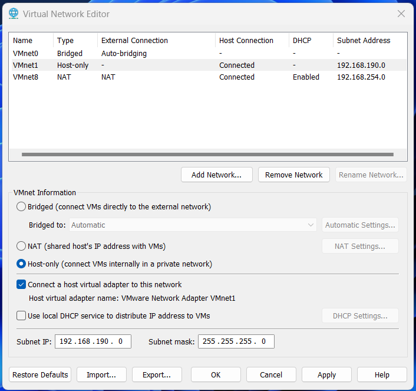
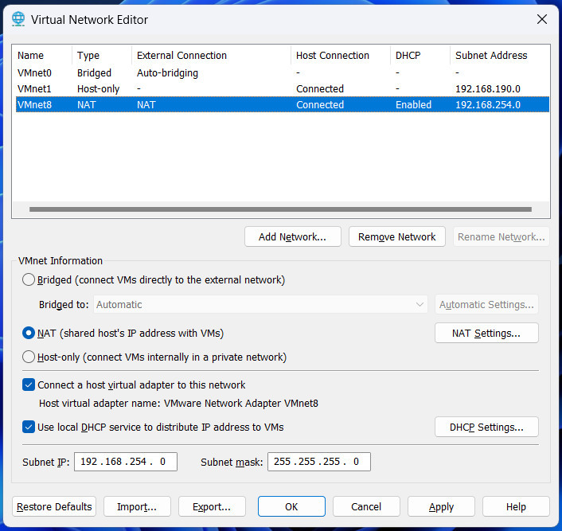

# Démarrage de l'hyperviseur

> Attention, si vous travaillez sur une machine de l'école, utilisez bien le dossier c:\admsys pour enregistrer vos machines virtuelles

## Configurer le Virtual Network (VmWare)

Edit > Virtual Network Editor

## Ouvrir une machine virtuel

Open a Virtual Machine

Storage path: c:\admsys\matricule\machine-name