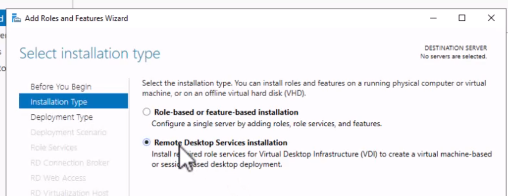
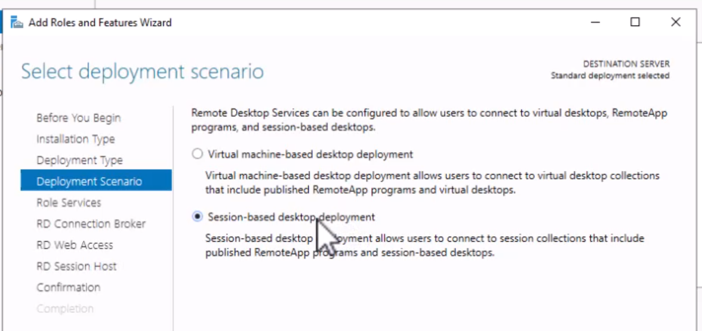
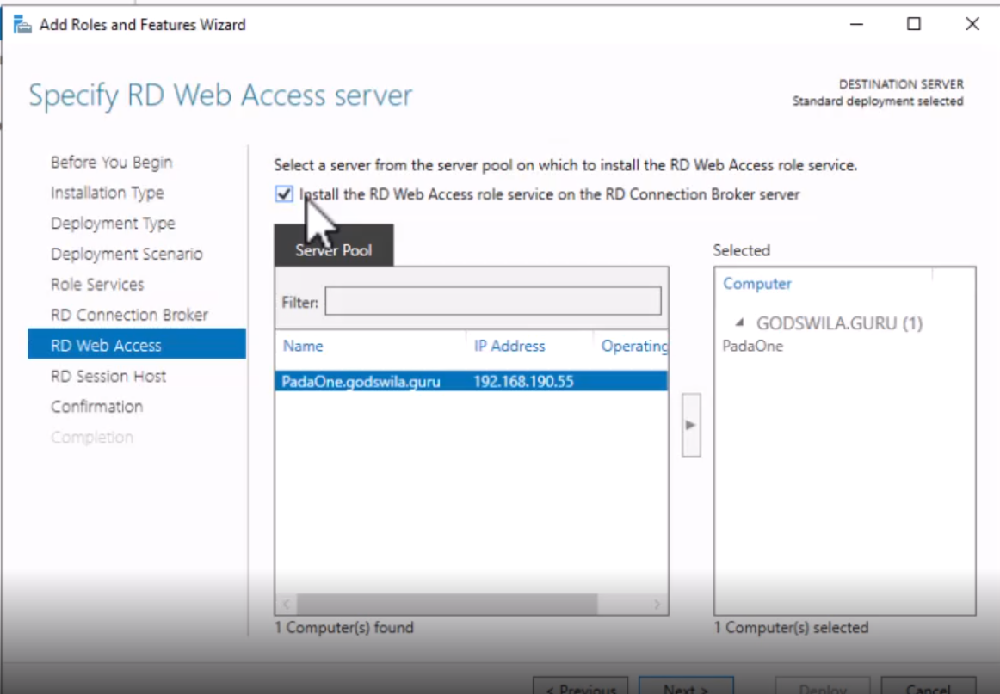
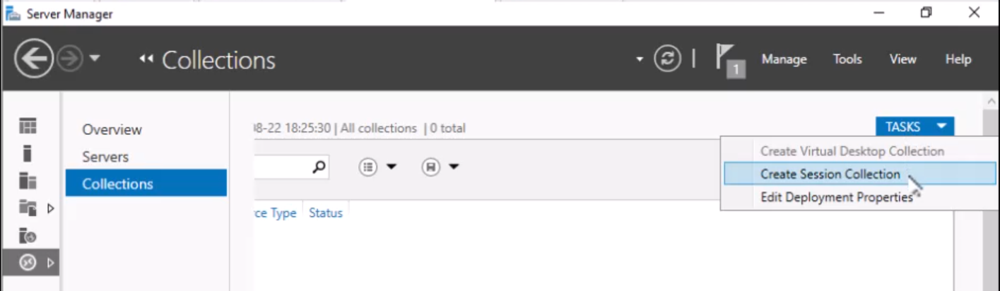
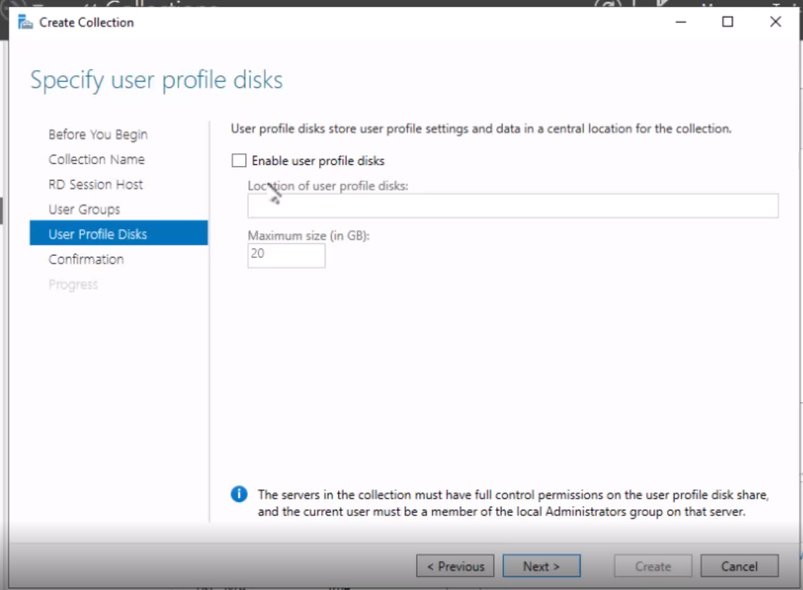
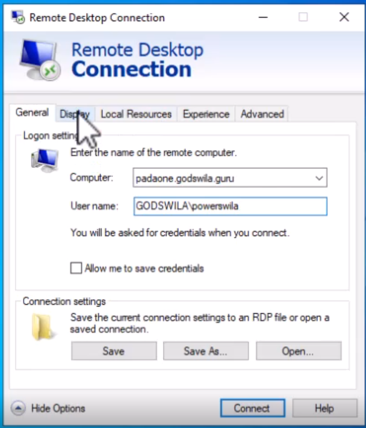
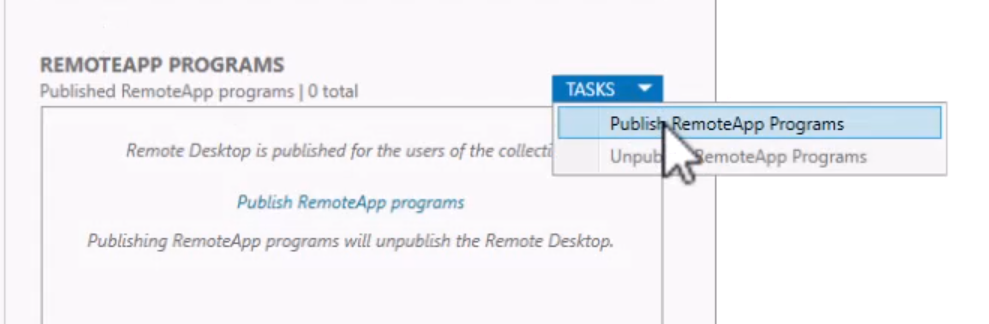

[Retour à la table des matières](../README.md)

# Remote desktop

Le remote Desktop permet d'ouvrir une session à distance

> Port 3389, VPN nécessaire

## Service Remote Desktop

Le service remote Desktop (Active directory) un nombre déterminé d'utilisateurs peuvent ouvrir une session

De démarrer des applications à distance, mais visibles localement (Via les remoteApps)

Licence soit par Utilisateur ou par Périphérique

## Installation du Service Remote Desktop

On ne peut pas installer ce service sur le contrôleur de domaine par sécurité.

> Il faut se connecter à la machine en tant qu'administrateur du domaine.

Server Manager > Tools > Add Roles and Features



Déploiement standard





Il faut se reconnecter avec le compte du contrôleur de domaine pour finaliser l'installation après le redémarrage.

## Configure Remote Desktop Services

Server Manager > Remote Desktop Services

Tasks > Create Session Collection





## Gestion des sessions

Lancez Remote Desktop



## RemoteApps

Server Manager > Remote Desktop Services

RemoteAPP Programs > Tasks > Publish RemoteApp Programs



### Utiliser la remoteApps via un client

Il faut ajouter un certificat sur les machines clientes

Pour cela il faut exécuter le script ([Get-RemoteSSLCertificate.ps1](scripts/Get-RemoteSSLCertificate.ps1))

```powershell
.\Get-RemoteSSLCertificate.ps1 -ComputerName padaone.godswila.guru -OutputCertificateName moncert.crt
```

Une fois le certificat généré il faut l'installer avec clic droit

### Ajouter une app via GPO

Group Policy Management > NEW GPO

User Configuration > Policies > Administrative Template > Windows Components > Remote Desktop Services > RemoteApp > 

URL: https://padaone.godswila.guru/RDWeb/Feed/webfeed.aspx

Ou utiliser sur le poste client : RemoteApp avec une URL

> Changez le nom de domaine par votre serveur

## Les GPO pour le Remote Desktop

Vidéo : 59:58