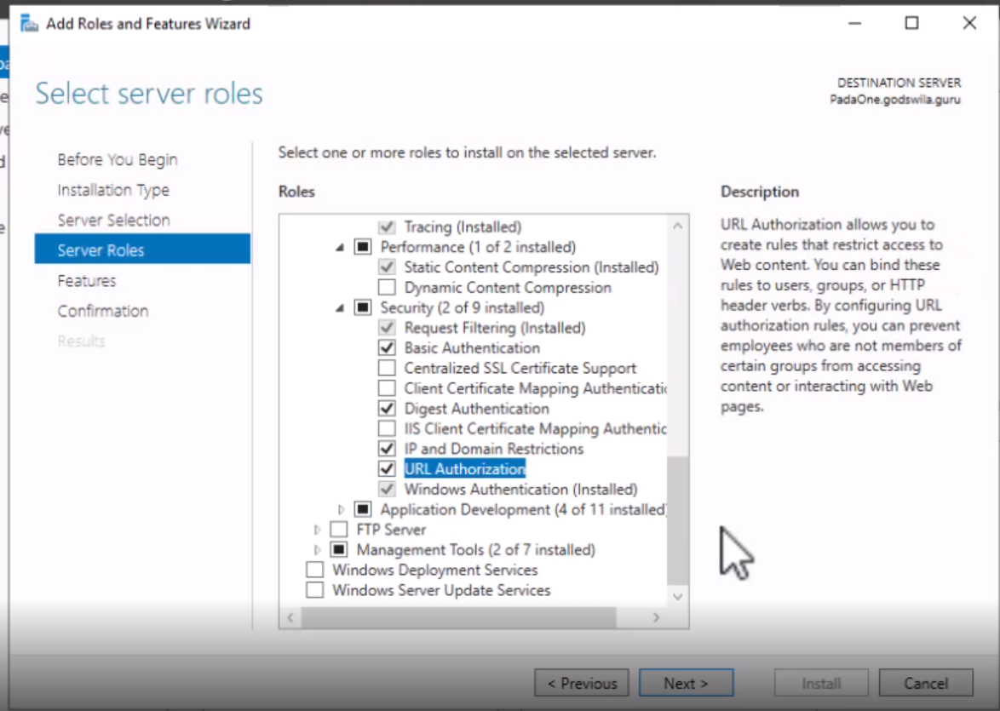
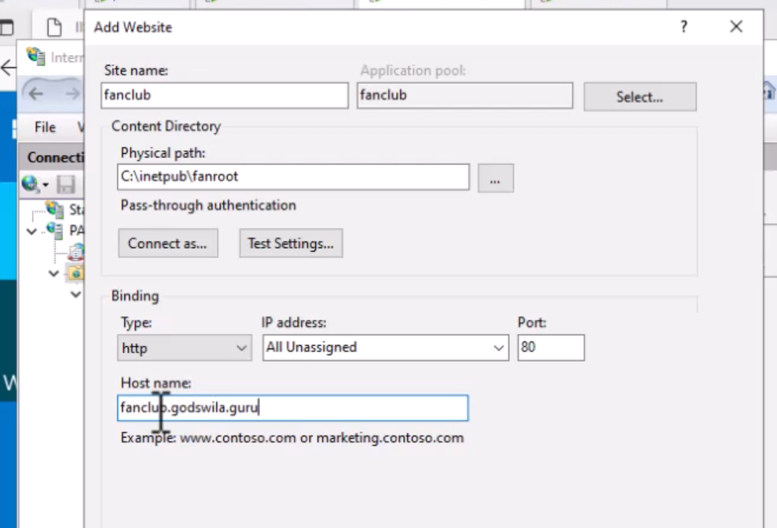
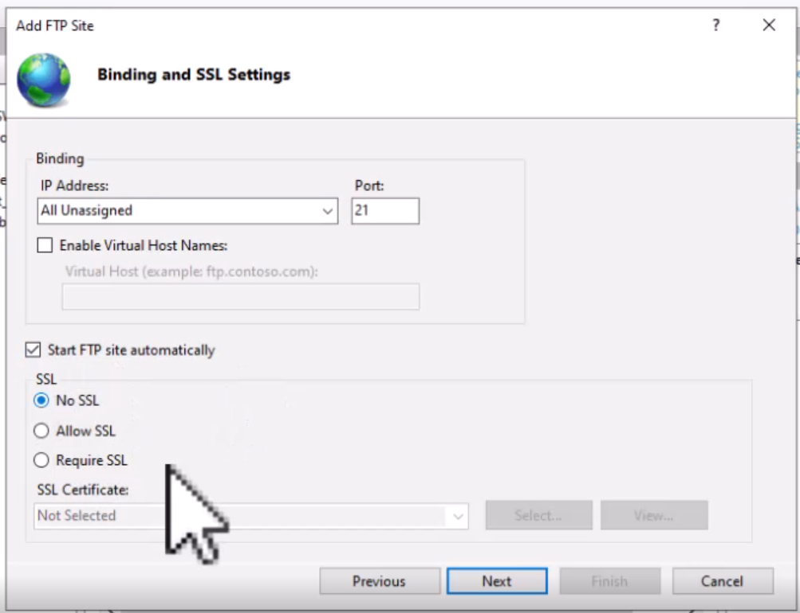
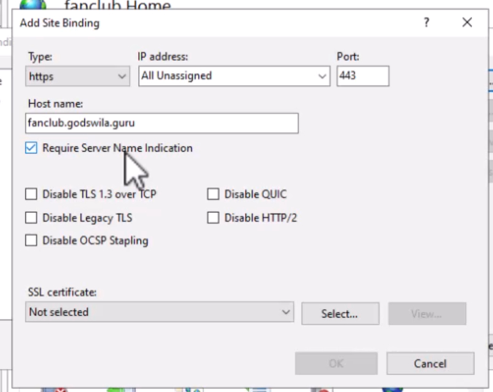

[Retour à la table des matières](../README.md)

# Service IIS et SSL

## IIS

Permets de mettre en ligne un site WEB (.NET / .NET Core)

Permets de mettre en ligne un serveur FTP (FTP SSL)

### Installation

Server Manager > Tools > Add Roles and Features > Server Roles > Web Server > Security

- Basic Authentication
- Client Certificate Mapping Authentication
- Digest Authentication
- Ip and Domain restriction
- Url Authorization
- Ftp Server

### Gérer les sites

Server Manager > Tools > IIS Manager > Add Website

Il est recommandé de placer les fichiers HTML du site dans le dossier (inetpub)

> Ne pas oublier de configurer le DNS pour la bonne url

## FTP

Mode d'installation (Passif)

IIS Manager > Add FTP Site

## TLS

Vidéo : 1:05:43

Installation d'un certificat dans IIS (.pfx)

mmc.exe > Certificate > Computer account 

Certificates > Personal > Certificate > All tasks > Import

Edit > Bidings > 

