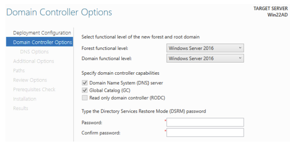
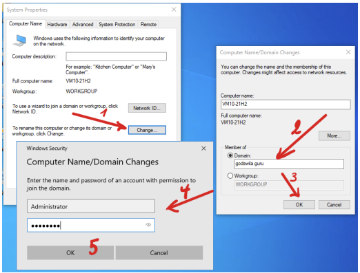

[Retour à la table des matières](../README.md)

# Domaine et utilisateurs

## Utilisateurs locaux

Server Manager

Tools > Computer Management > System Tools

Local Users and Groups

Par un clic droit, il est possible d'ajouter un nouvel utilisateur.

## Active Directory

Lorsqu'on promeut un serveur en contrôleur du domaine, les utilisateurs locaux sont convertis en utilisateurs du domaine ainsi que les groupes locaux.

### Installation

Server Manager

Notification > Post-deployment Configuration

Select Add a new forest

Root domain name: cgXXdom.local (où XX est votre numéro de machine)

L'étape suivante consiste à déterminer le niveau fonctionnel de notre infrastructure. (Windows Server 2016) à la fois pour la fôret et pour le domaine.



Ajoutez un mot de passe de récupération

> P@ssword

Pas besoin de modifier la configuration des délégations DNS

Une fois, effectuer, le serveur redémarre.

**Désactiver l'expiration des mots de passes**

Par défaut les mots de passe expirent après 42 jours.

Server Manager > Tools > Group Policy Management

Forest > Domains puis le domaine courant et faire un clic droit sur l'élément Default Domain Policy puis choisir Edit.

L'éditeur de gestion des stratégies de groupe s'ouvre.

Computer > Configuration > Policies > Windows Settings > Security Settings > Account Policies > Password Policy

- Enforce password history : **0 passwords remembered**
- Maximum password age : **0 days**
- Minimum password age : **0 days**
- Password must meet complexity requirements : **Disabled**

### Structure de l'annuaire

Server Manager > Tools > Active Directory Users and Computers

Créer une unité organisationnelle CGDOM, avec à l'intérieur, les unités suivantes:

1. DomUsers
2. DomGroups
3. PrivilegedUsers
4. Workstations
5. Servers

### Ajouter une unité organisationnelle

```powershell
New-ADOrganizationalUnit –Name "Mes sujets" -ProtectFromAccidentalDeletion $false -Path "DC=cgXX,DC=local"

New-ADOrganizationalUnit –Name "DomUsers" -ProtectedFromAccidentalDeletion $false -Path "OU=CGDom,DC=cgXXdom,DC=local"
```

### Ajouter un utilisateur

```powershell
New-ADUser -Name lsw -AccountPassword (ConvertTo-SecureString `
 -AsPlainText "P@ssword" -Force) -Enabled $true `
 -PasswordNeverExpires $true -CannotChangePassword $true `
 -SamAccountName lsw -UserPrincipalName lsw@godswila.guru `
 -Path "OU=Mes Sujets,DC=godswila,DC=guru" -GivenName "Louis" `
 -Surname "SWINNEN" -DisplayName "Louis SWINNEN"
```

Rendre un utilisateur administrateur

Properties > Member Of

Add > Domain Admins

### Ajouter un groupe de sécurité

```powershell
New-ADGroup -Name "SwilaBible" -samAccountName SwilaBible `
 -GroupCategory Security -GroupScope Global `
 -Path "OU=Mes sujets,DC=godswila,DC=guru"
```

### Ajouter un utilisateur au groupe

```powershell
Add-ADGroupMember ("CN=SwilaBible,OU=Mes Sujets, DC=godswila," + `
 "DC=guru") -Members ("CN=lsw,OU=Mes Sujets,DC=godswila," + `
 "DC=guru")
```

### Intégrer une machine dans le domaine

Il faut modifier le nom de la machine avant de l'ajouter (il doit être unique)

Modifier le serveur DNS pointant vers le contrôleur de domaine.



```powershell
New-ADComputer -Name "VM10-21H2" -SamAccountName "VM10-21H2" `
 -Path "OU=Mes sujets,DC=godswila,DC=guru"
```