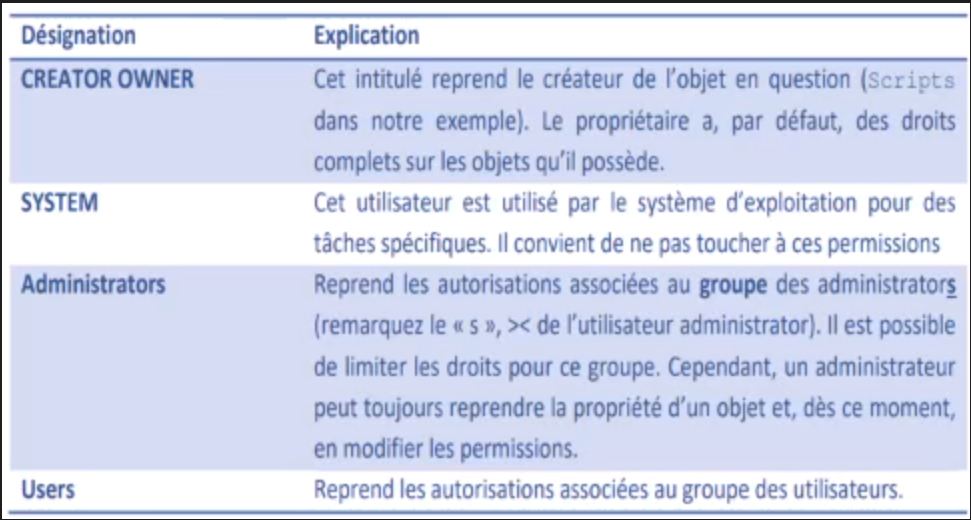
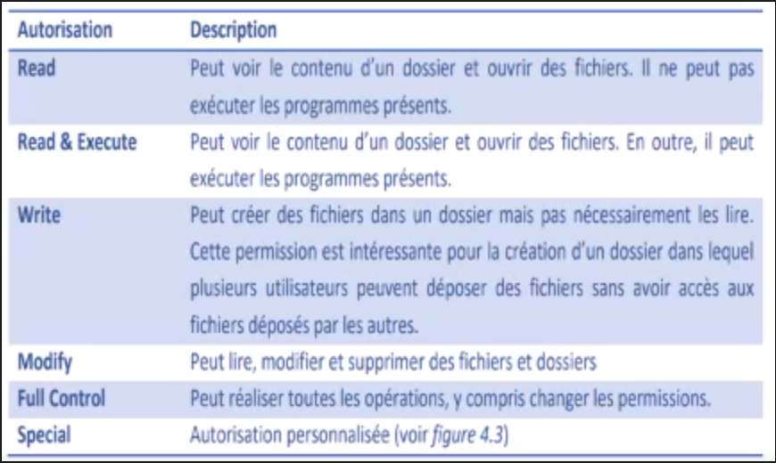
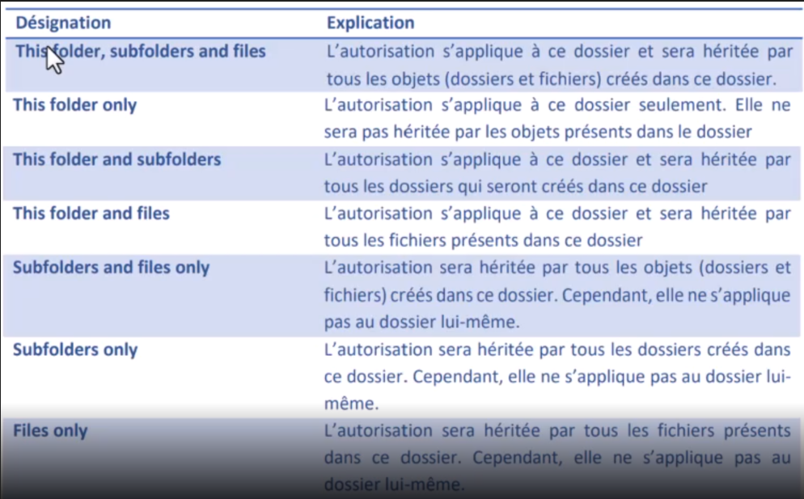
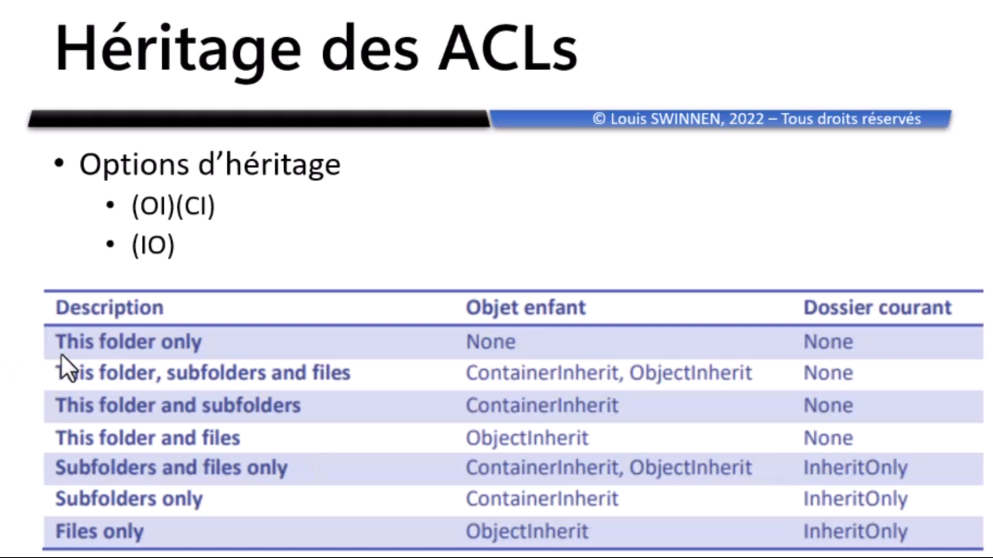
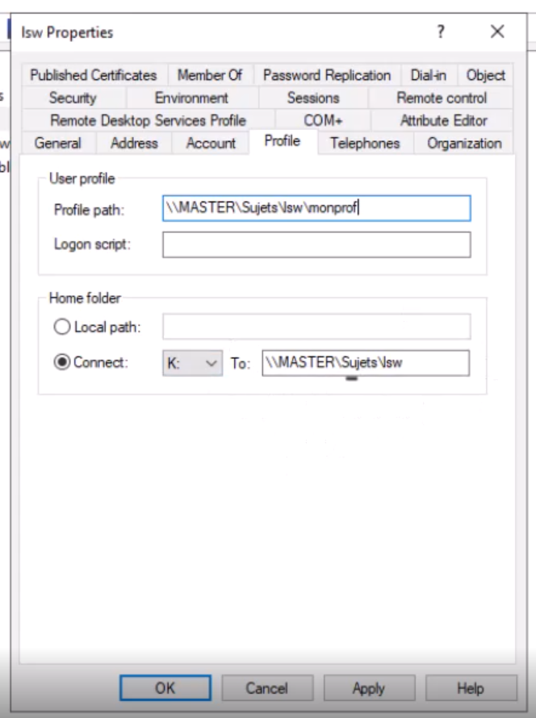

[Retour à la table des matières](../README.md)

# Espace disque, partage et droits

> Afficher les dossiers et fichiers cachés: View > Options > View (Hide empty drives & Hide extensions for known file types)

## Les volumes

Windows Server Manager

Tools > Computer Management > Disk Management

## Les droits ACL







## Modification des permissions

Properties > Security > Edit

> Attention pour supprimer les permissions d'un dossier, il faut s'assurer de supprimer l'héritage (Disable inheritance => Convert)

```powershell
$acl = Get-ACL -Path "C:\TestACL" # Récupère les infos des ACL
$acl | select-Object * # Voir les infos

#Enlever l'héritage
$acl.SetAccessRuleProtection($true, $true) #Param 1 = Activer ou désactover l'hérotage (true = desac), Param 2 = conserver les permissions (true)
Set-Acl -Path "C:\TestAcl" $acl

# Ajouter des droits à un utilisateur
$rule = New-Object System.Security.AccessControl.FileSystemAccessRule("GODSWILA\Powerswila", "Modify", "Allow")
$acl.SetAccessRule($rule)
Set-Acl -Path "c:\TestAcl" $acl

$rule = New-Object System.Security.AccessControl.FileSystemAccessRule("GODSWILA\Powerswila", "FullControl", "ContainerInherit,ObjectInherit", "None", "Allow")
```



## Les quotas

> Attention ne pas utiliser les quotas avec les quotas sur un chemin en même temps.

This PC > Disk > Properties > Quota

- Enable quota management
- Deny disk space to users exceeding quota limit

Modifier les quotas pour certains utilisateurs

Quota Entries

```powershell
&"fsutil" "quota" "modify" "C:" "900 000000" "1000 000000" "powerswila"
```

## Quotas sur un chemin

Tools > File Server Resource Manager

Création de templates de quota

Quota Template > Create Quota Template

Copy from existing template

Appliquer la template:

Quotas > Create Quota

Indiquer le path du dossier et sélectionner un template

```powershell
New-FSRMQuota -Path "C:\testQuota" -Template "Limit150Mo"
New-FSRMAutoQuota -Path "C:\testQuota" -Template "Limit150Mo"
```

> Le quota automatique permet d'hériter le quota aux sous-dossiers.

## Les partages

Properties > Sharing > Advanced Sharing

Share this folder

Permissions > Remove Everyone

Add Authenticated Users (Cocher change)

> Ne pas oublier de modifier les ACLs

Accéder aux partages depuis une autre machine

Mapper une lettre au lecteur

```powershell
Cmd
net view \\MASTER # Affiche les partages
net use M: \\MASTER\TestPartage # Connect
```

## Les profils utilisateurs

Swilabus Réapropriation: 1:35:57

File Server Manager > Active Directory Users and Computers > User > Profile

- Profile path
- Home folder



> Il est impossible pour l’admin de rentrer dans le dossier monprof.V6 (pour régler le problème il faut créer le dossier à l’avance ou remplacer le owner par Administrator et replace all child object permission entries)

```powershell
# Parametre en plus de la commannde New-AdUser
-ProfilePath "\\MASTER\Sujets\jedi\monprof" -HomeDirectory "\\MASTER\Sujets\jedi\" -HomeDrive "K:"

Ou Set-AdUser
```