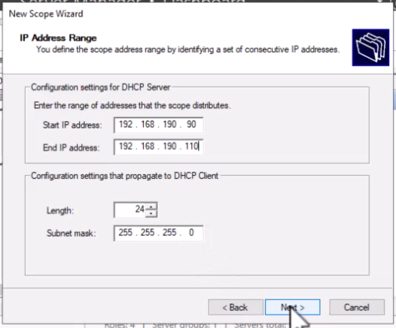
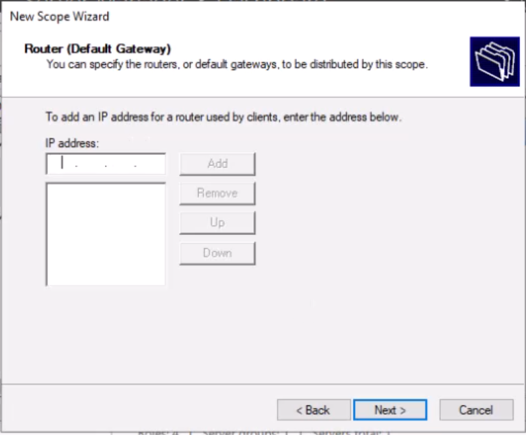
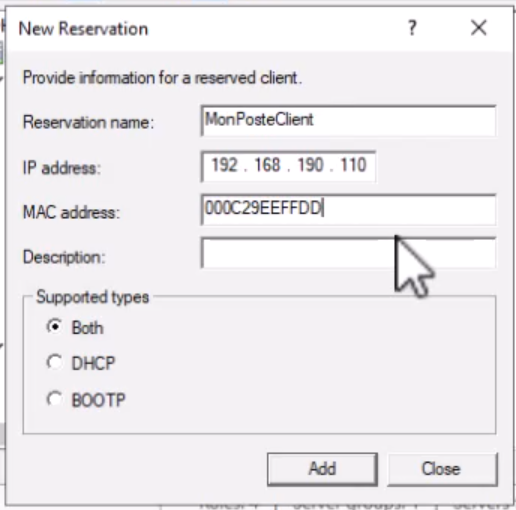
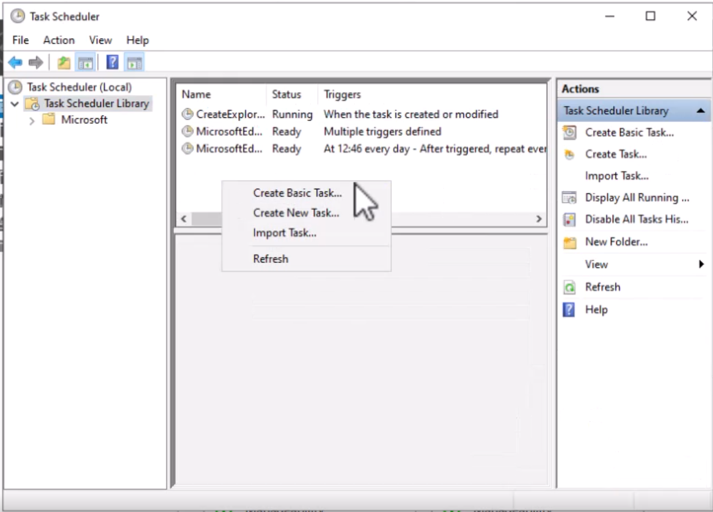

[Retour à la table des matières](../README.md)

# Services de base

## DNS

Server Manager > Tools > DNS

Forward Lookup Zones

> Permets d'associer un nom à une adresse IP (Domain => IP)

Reverse Lookup Zones

> Permets d'associer une adresse IP à un nom de domaine (IP => Domain)

Si le serveur ne sait pas résoudre un nom de domaine, il va forwarder la requête à un forwarders configuré.

Pour configurer un forwarders il faut:

DNS > Master > Properties > Forwarders > ajouter l'IP de pfSense

### Ajouter une zone DNS

Clic droit > New Zone

1. Primary Zone
2. To all Dns server running on domain controller in this domain
3. Nom de domaine
4. Allow only secure dynamic updates

| Type d’entrée |  |
| --- | --- |
| A | Name ⇒ IPV4 |
| AAAA | Name ⇒ IPV6 |
| CNAME | Name ⇒ Name |
| MX | Mail |
| NS | DNS |
| TXT | Texte (challenge) |

```powershell
Add-DnsServerResourceRecordA -Name "maitre" -zonename "swila.com" -IPv4Address "192.168.1.3"
Add-DnsServerResourceRecordAAAA
Add-DnsServerResourceRecordCName -Name "master" -HostName "alias.com"
```

### Les zones inverses : Reverse Lookup Zones

PTR : Permets de faire pointer une adresse vers un nom

CNAME : Permets de créer un alias

```powershell
Add-DnsServerResourceRecordPtr -Name "55" -PtrDomainName "padaone.godswila.guru" -ZoneName "190.168.192.in-addr.arpa"
```

## DHCP

> Attention il faut désactiver le serveur DHCP de pfSense !

Notification DHCP > Complete DHCP configuration

Server Manager > Tools > DHCP

IPV4 > New Scope





Les réservations peuvent lier une adresse IP à une adresse MAC



En powershell

```powershell
get-dhcpserverv4Scope
Add-DhcpServerv4Reservation -scopeid "192.168.190.0" -IPAddress "192.168.190.110" -ClientId "mac adress"
```

## Planificateur de tâches

Server Manager > Tools > Task Scheduler > Create New Task

