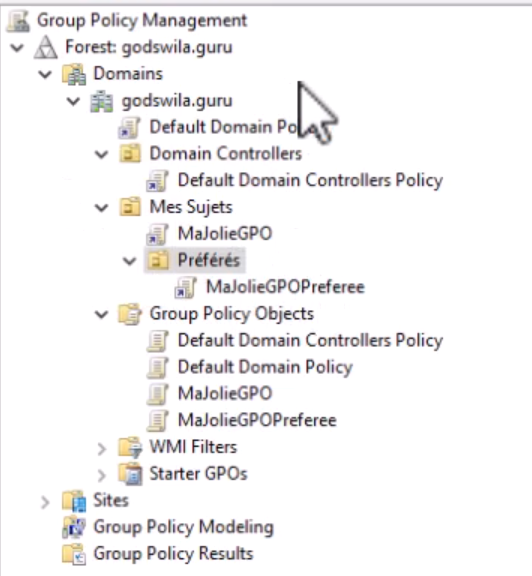
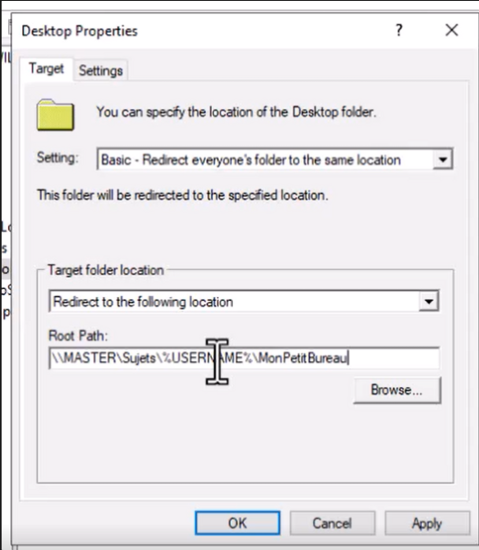
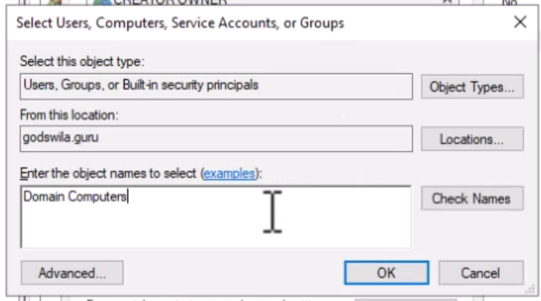
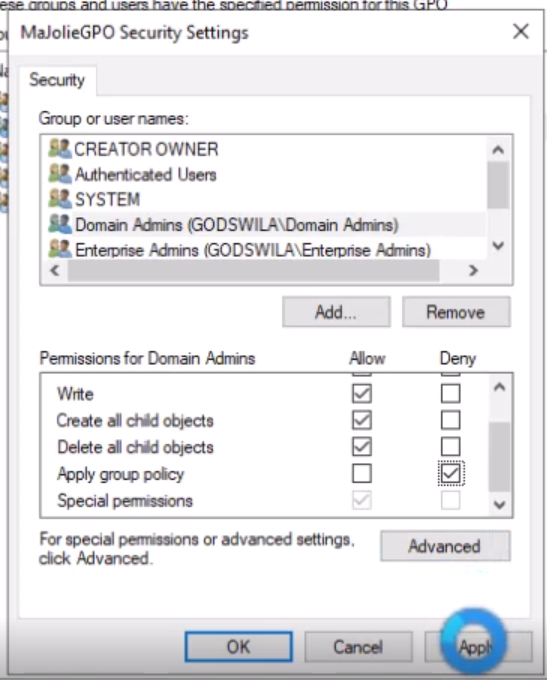

[Retour à la table des matières](../README.md)

# GPO et politiques de sécurité

Gestion centralisée des règles et configuration sur tout un domaine.

Forcer les GPO : gpupdate /force

Server Manager > Tools > Group policy management

## Ajouter une GPO

Ajouter une GPO dans le dossier Group Policy Objects

Une fois la GPO créée, il va falloir la lier à une OU (Unité organisationnelle)

## Editer une GPO

Clic-droit éditer

> Attention, on ne mélange pas les User Configuration avec les Computer Configuration

## Stratégie Courantes

### Connecter un lecteur réseau

User Configuration > Preferences > Windows Settings > Drive Maps

### Exécuter un script

User Configuration > Policies > Windows Settings > Scripts > Logon

> Les scripts sont lancés après 5 minutes (Pour changer il faut modifier une GPO Computers > Configure Logon Script  Delay)

> Attention l'emplacement du script doit être accessible via le réseau et configurer avec de bon ACL

### Permettre la connexion d’un utilisateurs sur le controleur de domaine

Computer Configuration > Policies > Windows Settings > Security Settings > Local Policies > User R > Allo logon on locally > Add User

> Il faut modifier le Default Domain Controllers Policy

### Empecher de voir qui est le dernier utilisateur de la machine

Computer Configuration > Policies > Windows Settings > Security Policies > Local Policies > Security Options > Interactive logon: Don’t display last signed-in

### Redirection de dossier

User Configuration > Policies > Windows Settings > Folder Redirection > Desktop >

### Redirection ordinateur obligatoire

Computer Configuration > Policies > Administrative Template > 

System > Group Policy > Configure folder redirection policy processing > enabled > process even if the group …

### Interdir le CMD

User Configuration > Policies > Administrative Template > System > Prevent access to the command prompt

### Configure Logon Script Delay

Computer Configuraion > Administrative Template > System > Group Policy > Configure Logon Script Delay

### Afficher un message avant de se connecter

Computer Configuration > Policies > Windows Settings > Security Settings > Local Policis > Security Options > Interactive Logon Message

### Autoriser un compte à Remote Desktop

Computer Configuration > Policies > Windows Settings > Security Settings > Local Policies > User Right > Allow log on through Remote Desktop Service

## Limiter la portée d'une GPO

Pour modifier la portée à un certain groupe on peut modifier le sécurity filtering

> Attention il faut obligatoirement ajouter "Domain Computers" dans l'onglet Delegation

Ajouter une exception pour les ADMIN

Delegation > Advanced > Domain Admins > Apply group policy > Deny

