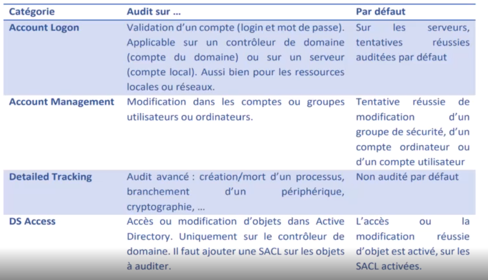

[Retour à la table des matières](../README.md)

# Administration et GPO avancées

## Déploiement d'application

Seuls les packages MSI peuvent être déployés avec une GPO d'installation

Privilégier un déploiement par ordinateurs que par utilisateurs.

> Le fichier .msi doit être disponible sur le réseau (Partage réseau avec les bons ACL, Domain Computers doit y avoir accès)

Server Manager > Tools > Group Policy Management

New GPO  > Policies > Software Settings

## Déléguer la gestion

### Par GPO

Le compte admin du créateur du domaine est assez critique, il est préférable de créer plusieurs autres comptes administrateur avec moins de droits.

Server Manager > Tools > Group Policy Management

New GPO > Computer Configuration > Policies > Windows Settings > Security Settings > Restricted Groups

> Permets de donner des droits à un groupe (exemple: Administrators)


### Par une unité organisationnelle

Server Manager > Tools > Active Directory Users and Computers

Clic Droit > Delegate Control


## Les audits

Permets d'avoir des logs sur certaines actions / objets

```powershell
auditpol /get /category:*
```

```powershell
auditpol /backup /file:C:\TEMP\AuditDefault.csv
auditpol /restore /file:C:\TEMP\AuditDefault.csv
```




Il faut activer les Audits avancées vie une GPO

Server Manager > Tools > Group Policy Management

New GPO > Computer Configuration > Policies > Windows Settings > Security Settings > Security Options > Audit: Force audit ...


Security Settings > Advanced Audit Policy Configuration


Appliquer une audit sur un dossier


## Les boucles de rappels

Server Manager > Tools > Group Policy Management

New GPO > Computer Configuration > Policies > Administrative Template > System > Group Policy > Configure user Group Policy loopback processing mode

> Mode replace = stratégie utilisateur, on ne prend pas compte de la stratégie ordinateur

> Merge = les deux stratégies


User Configuration > Policies > Windows Settings > System > Prevent access to the ...