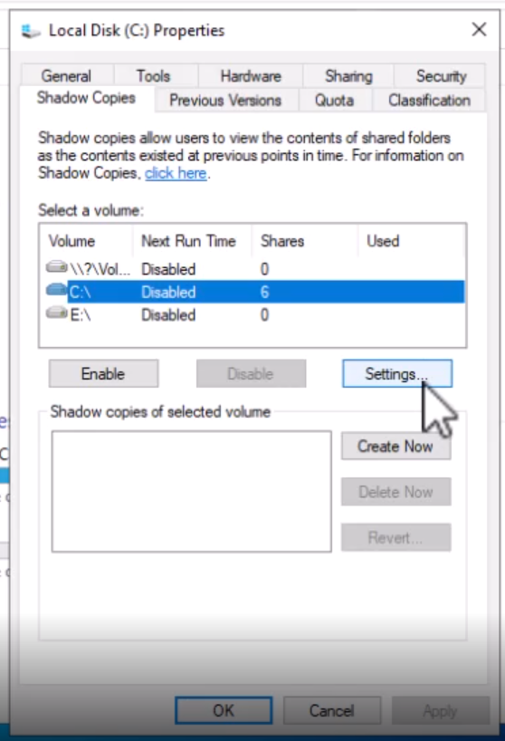
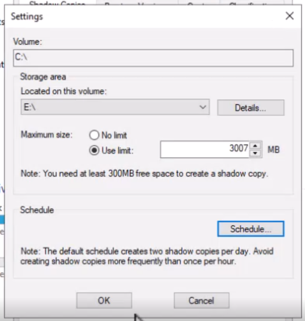
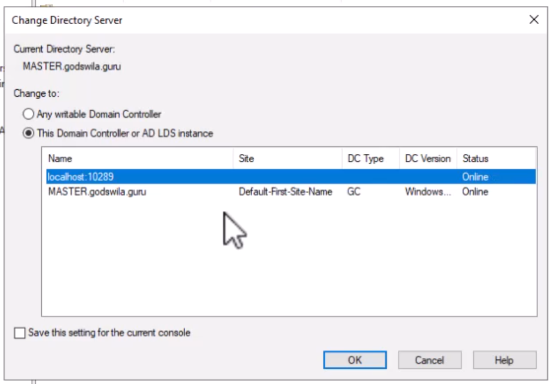
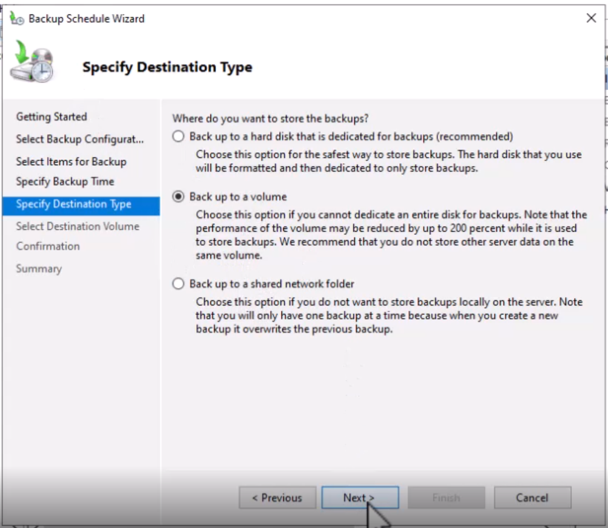

[Retour à la table des matières](../README.md)

# Sauvegarde et restauration

## Les Shadow Copies

Les clichés instantanés permettent de réaliser un cliché du disque dur pour pouvoir sauvegarder les données dans un état cohérent

Les clichés peuvent être activés:

- Les partages disques
- Trouver une version précédente d'un fichier

Activer les clichés :

CE PC > DISK > Clic-droit > Properties > Shadow Copies > 





## Restauré un cliché

Clic-droit sur un dossier > Properties > Previous Versions

## Cliché instantané Active Directory

Vidéo: 24:10

```powershell
ntdsutil snapshot "activate instance ntds" create quit quit

ntdsutil
snapshot
activate instance ntds

snapshot
list all

mount 1 # Pour recupérer dans un dossier

dsamain -dbpath "C:\$SNAP_PATH" -ldapport 10289
```

Héberge un serveur Active Directory pour pouvoir voir l'état de la backup



```powershell
ntdsutil snapshot "unmount *" quit quit
```

## Windows Server Backup

Server Manager > Tools > Windows Server Backup

Backup Schedule > Custom > 



On peut modifier le scheduler dans le Task Scheduler dans Windows > Backup